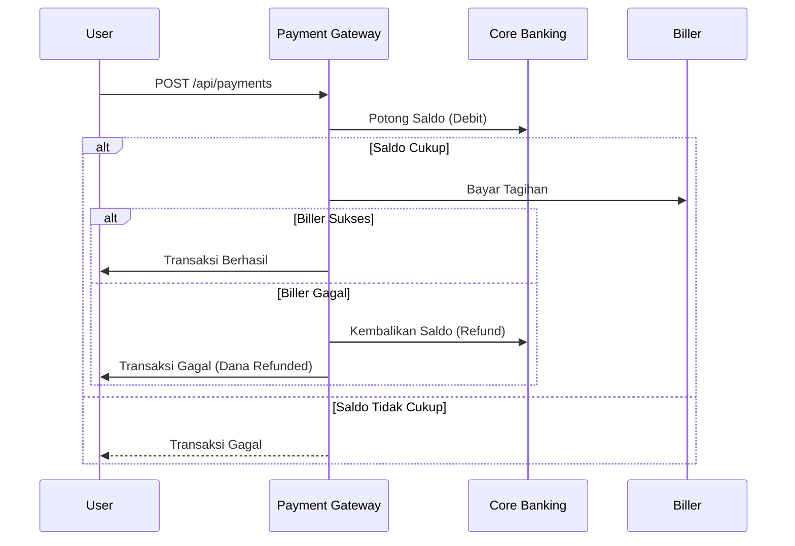

# Payment Gateway - Coding Assessment

Proyek ini adalah implementasi Payment Gateway service sederhana menggunakan Spring Boot. Dibuat untuk memenuhi kualifikasi assessment backend developer.

## Alur Transaksi 
Berikut adalah gambaran kasar flow transaksinya:



## Cara Menjalankan Proyek

### 1. Persiapan
Pastikan Anda sudah menginstall Docker di mesin lokal. Copy file `.env.example` menjadi `.env` sebelum memulai:
```bash
cp .env.example .env
```

### 2. Run menggunakan Docker Compose

```bash
docker-compose up --build
```
Aplikasi akan jalan di `http://localhost:8080`.

### 3. API Documentation
Saya sudah menyediakan Swagger untuk memudahkan testing endpoint:
- **Swagger UI**: [http://localhost:8080/swagger-ui.html](http://localhost:8080/swagger-ui.html)

---

## Panduan Testing Skenario
Saya menyertakan **MockExternalController** untuk mensimulasikan berbagai kondisi tanpa perlu external service beneran:

### A. Pembayaran Sukses
Kirim request normal (amount di bawah 1jt).
```json
{
  "orderId": "INV-001",
  "channel": "MOBILE_BANKING",
  "amount": 250000,
  "account": "1234567890",
  "paymentMethod": "VIRTUAL_ACCOUNT"
}
```

### B. Saldo Tidak Cukup (Gagal di Bank)
Kirim request dengan **amount > 1.000.000**.
Sistem akan otomatis menolak transaksi karena saldo dianggap tidak cukup.

### C. Gagal di Biller (Trigger Refund/Reversal)
Kirim request dengan `"paymentMethod": "FAIL"`.
Sistem akan berhasil melakukan debit di bank, namun sengaja dibuat gagal saat ke Biller. Di sini mekanisme **Refund** otomatis akan berjalan untuk mengembalikan saldo user.

---

### Spesifikasi Teknis
- **Java**: 17
- **Database**: PostgreSQL (Migrations menggunakan Flyway)
- **Framework**: Spring Boot 3.3.x
- **Resilience**: Resilience4j (Circuit Breaker & Retry)

